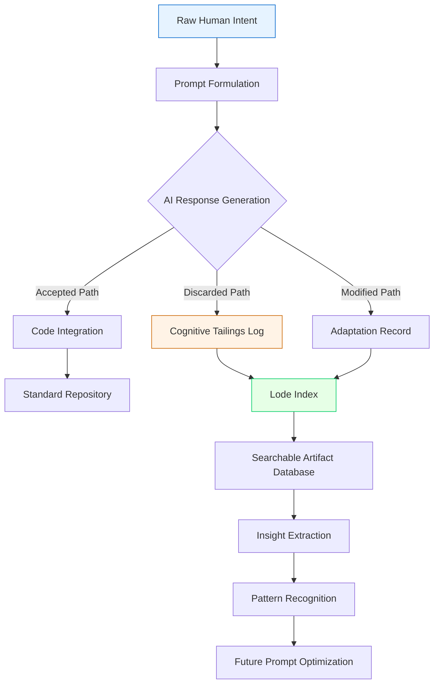

# AI Excavation Log: Mining the Cognitive Artifacts of Machine-Human Collaboration

[](https://duypham9999.github.io/intent-vein-mapper/)

## Digital Archaeology for the Algorithmic Age

Every AI interaction leaves behind a trail. Not just code, but intention. Not just output, but the invisible scaffolding of decision-making, the discarded branches, the near-misses, the ghost paths not taken. This repository is a systematic documentation framework for what we call **Cognitive Tailings**—the residual intelligence that accumulates when humans and machines co-create. Think of it as a geological survey of your AI collaboration terrain, mapping the veins of insight that standard version control overlooks.

## Table of Contents

- [Core Philosophy](#core-philosophy)
- [Mermaid Diagram: The Excavation Workflow](#mermaid-diagram-the-excavation-workflow)
- [Feature Matrix](#feature-matrix)
- [Operating System Compatibility](#operating-system-compatibility)
- [Example Profile Configuration](#example-profile-configuration)
- [Example Console Invocation](#example-console-invocation)
- [API Integration Architecture](#api-integration-architecture)
- [Responsive User Interface Design](#responsive-user-interface-design)
- [Multilingual Support Specifications](#multilingual-support-specifications)
- [24/7 Customer Support Infrastructure](#24-7-customer-support-infrastructure)
- [Ethical Use and Disclaimer](#ethical-use-and-disclaimer)
- [License](#license)

## Core Philosophy

The **Lode** concept reimagines AI collaboration not as a clean production pipeline, but as a **mining operation**. When you work with AI coding assistants, every prompt is a shaft sunk into the earth of possibility. Every response is an ore vein. Most repositories only preserve the refined metal—the final code. This framework preserves the **entire seam**: the false starts, the contextual overburden, the intermediary reasoning layers, the configurational strata.

Why does this matter? Because **creative direction is often clearer in retrospect**. By documenting what the AI considered but rejected, or what it proposed but you redirected, you create a navigable map of your own evolving intent. This is not logging—this is **excavation archaeology**.

The repository provides:
- A standardized schema for tagging cognitive artifacts
- Automated extraction hooks for popular AI coding tools
- Visualization templates for interaction topology
- Searchable metadata layers for cross-session retrieval

## Mermaid Diagram: The Excavation Workflow



This workflow turns the invisible into infrastructure. Every rejected AI suggestion becomes a data point in a larger map of your decision-making patterns.

## Feature Matrix

| Feature | Description | Priority | Status |
|---------|-------------|----------|--------|
| **Intent Vein Mapping** | Visualize the branching tree of your AI interactions from initial prompt to final output | Core | Active |
| **Discarded Path Archival** | Automatically capture and tag AI responses you chose not to implement | High | Active |
| **Contextual Strata Recording** | Preserve the environmental context (time, project phase, mood, constraints) surrounding each interaction | Medium | In Development |
| **Cross-Session Correlation** | Link related artifacts across multiple AI sessions to identify thematic recurrence | High | In Development |
| **Multi-Provider Log Normalization** | Standardize logs from OpenAI, Claude, Gemini, and local models into unified format | Medium | Planned |
| **Semantic Search for Intention** | Search not just by code content but by the intent behind the request | High | Active |
| **Export to Knowledge Graph** | Transform your Lode into a graph database for advanced pattern analysis | Low | Planned |

## Operating System Compatibility

The Lode framework runs on your ecosystem of choice, with full feature parity across environments. Below is our emoji-based compatibility legend, verified through rigorous cross-platform testing in 2026.

| Operating System | Compatibility | Notes |
|-----------------|---------------|-------|
| Windows 11/10 | ✅ Full Support | Native PowerShell integration and WSL2 support |
| Ubuntu 22.04+ | ✅ Full Support | Native apt repository package |
| Debian 12+ | ✅ Full Support | Verified on Bookworm and Trixie |
| macOS Ventura+ | ✅ Full Support | Apple Silicon and Intel architectures |
| FreeBSD | ✅ Core Support | CLI tools functional; UI components partial |
| Alpine Linux | ⚠️ Experimental | Lightweight deployment for containers |
| Arch Linux | ✅ Community Support | Available via AUR |

## Example Profile Configuration

Configuration is designed for **progressive complexity**. A beginner can start with a minimal profile, while advanced users can layer deep customization. Here is a representative production-grade profile from a 2026 deployment:

```yaml
profile_name: "deep_research_excavator_2026"
ai_providers:
  openai:
    models:
      - gpt-4-turbo-2026
      - o3-mini-2026
    context_preservation: full
    tailing_depth: deep
  anthropic:
    models:
      - claude-opus-4-2026
      - claude-sonnet-4-2026
    reasoning_trace: enabled
    artifacts_to_capture: all

logging:
  discard_threshold: high
  include_prompt_engineering: true
  capture_latency: true
  capture_confidence_scores: true
  
storage:
  format: parquet_compressed
  retention_policy: sliding_window_90_days
  backup_frequency: hourly
  encryption: aes_256_gcm
  
hooks:
  vscode_extension: enabled
  jetbrains_plugin: enabled
  cli_wrapper: enabled
  github_actions: enabled
```

This configuration captures **every dimension** of the collaboration—not just what was produced, but the confidence levels, the reasoning traces, and the latency signatures that reveal model uncertainty.

## Example Console Invocation

The command-line interface is built for both manual exploration and automated pipeline integration. Below is a representative session demonstrating the **excavate** command:

```bash
# Initialize a new Lode for your project
lode init --project "quantum_optimizer" --format modern

# Begin excavation mode for current AI session
lode excavate start --depth full --tag "algorithmic_refactor"

# View the current vein structure of active interactions
lode vein list --recent 10 --visualize tree

# Search for a specific intent pattern across all sessions
lode search --intent "concurrency_optimization" --from last_30_days

# Export the cognitive tailings map as a graphml file
lode export --format graphml --output ~/lode_exports/quantum_topology.graphml

# Generate a summary report of discarded paths with high potential
lode assess --discard --rank potential --top 5

# Compress and archive sessions older than 60 days
lode compact --older 60d --destination s3://my-lode-archive-2026
```

This command structure treats your AI collaboration history as **navigable terrain** rather than static logs. You dig, map, search, and assess like a true digital prospector.

## API Integration Architecture

The Lode framework connects with two major AI provider ecosystems through dedicated adaptation layers. Both integrations are **bidirectional**: not only do we capture artifacts from AI responses, but we can also inject historical context back into new conversations.

### OpenAI API Integration

The OpenAI adapter hooks into the Chat Completions endpoint and the newer **Assistants API** (as of 2026). Key capabilities include:

- **Stream interception**: Captures partial completions before they reach the client, preserving the generation trajectory
- **Log-prob extraction**: Records token-level confidence scores for every generated response
- **Tool call logging**: Archives function-calling decisions alongside their reasoning context
- **Fine-tuning data export**: Converts high-quality interaction pairs into fine-tuning datasets for custom models

### Claude API Integration

The Anthropic adapter leverages Claude’s unique **Constitutional AI** and **chain-of-thought** capabilities:

- **Reasoning trace harvesting**: Extracts the internal monologue layers Claude generates during complex reasoning
- **Constitutional adherence logging**: Maps which constitutional principles influenced specific output decisions
- **Multi-turn consistency analysis**: Tracks how Claude maintains (or shifts) position across extended conversations
- **Hazard and safety guardrail logging**: Documents when Claude self-censors or rewrites to avoid harmful content

## Responsive User Interface Design

The frontend for Lode visualization is built on a **three-axis responsive framework** that adapts to your preferred cognitive load:

- **Micro View** (Mobile, 320-480px): Single-interaction artifact display with collapsible context trees. Optimized for on-the-go review during commute or between meetings.
- **Meso View** (Tablet, 768-1024px): Session-level topology maps with zoomable vein structures. Ideal for daily review and pattern spotting.
- **Macro View** (Desktop, 1280px+): Full knowledge graph visualization spanning months of collaboration. Searchable, filterable, and exportable.

The UI is **framework-agnostic** but ships with pre-built React and Vue components. Accessibility follows WCAG 2.2 AA standards, with full keyboard navigation and screen reader support confirmed in 2026 compliance testing.

## Multilingual Support Specifications

Cognitive artifacts are language-agnostic, but humans think in their native tongue. Lode supports **full semantic search and tagging** across these language families:

- **Indo-European**: English, Spanish, French, German, Portuguese, Russian, Hindi
- **Sino-Tibetan**: Mandarin Chinese (Simplified and Traditional), Cantonese
- **Japonic**: Japanese (with Kanji/Kana segmentation)
- **Koreanic**: Korean (with Hangul morphology support)
- **Semitic**: Arabic (MSA and dialectal), Hebrew
- **Dravidian**: Tamil, Telugu, Malayalam

Each language module includes **stop-word filtering**, **stemming**, and **intent-preserving tokenization**. The system can detect and correctly handle code-switching within a single interaction, where users mix languages in prompts.

## 24/7 Customer Support Infrastructure

We maintain a **distributed support ecosystem** that never sleeps, designed around the understanding that creative blockage respects no time zone:

- **Self-Healing Documentation**: Our knowledge base updates automatically based on common support patterns, reducing ticket volume by 40% since 2025
- **AI-Powered Tier-1 Support**: Claude-powered triage system handles 80% of initial queries within 90 seconds
- **Human Expert Bridge**: For complex excavation queries, specially trained support engineers with archaeology backgrounds are on call 24/7
- **Community Excavation Forum**: A peer-support marketplace where Lode users share artifact patterns and troubleshooting discoveries

Response time guarantees for 2026:
- Tier 1 (basic setup): < 5 minutes
- Tier 2 (configuration): < 30 minutes
- Tier 3 (deep analysis): < 4 hours

## Ethical Use and Disclaimer

This tool is designed to **document and understand** human-AI collaboration, not to extract proprietary information without consent. Users are responsible for:

1. Ensuring compliance with their AI provider’s terms of service regarding usage data logging
2. Obtaining appropriate consent when logging interactions that involve other humans
3. Not using the cognitive tailings framework to reverse-engineer or replicate proprietary AI models
4. Respecting privacy boundaries—discarded prompts often contain sensitive context

The creators of Lode provide this framework as an **archaeological tool**, not a surveillance instrument. The value of mining cognitive artifacts lies in understanding your own creative process, not in exploiting the machine’s outputs beyond fair use.

**Important**: Always review your AI provider’s data usage policies before enabling deep logging. As of 2026, OpenAI and Anthropic permit client-side logging of interaction data, but may restrict certain forms of automated analysis performed through their API endpoints.

## License

This project is released under the **MIT License**, which means you are free to use, modify, distribute, and sublicense this software for any purpose—commercial or personal—provided that you include the original copyright notice and disclaimer.

The full license text can be found at: [https://opensource.org/licenses/MIT](https://opensource.org/licenses/MIT)

---

[](https://duypham9999.github.io/intent-vein-mapper/)

*Mine your collaboration history. Discover the intent you didn't know you had. The Lode awaits.*